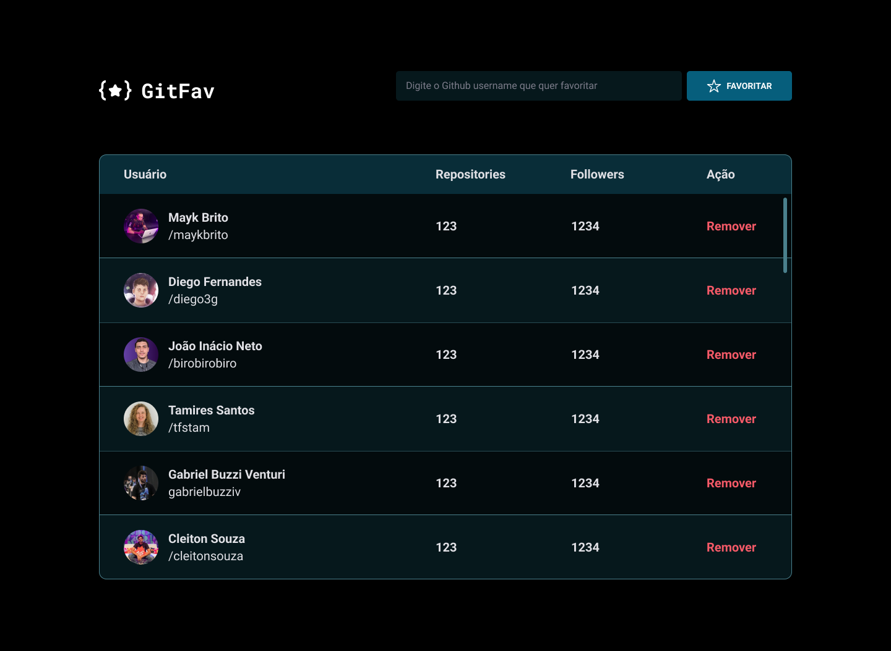

  Desafio realizado dentro do Explorer 
  <a href="https://www.rocketseat.com.br/explorer">Estude esse projeto em formato de vídeo clicando aqui.</a>

  <a href="#-tecnologias">Tecnologias</a>&nbsp;&nbsp;&nbsp;|&nbsp;&nbsp;&nbsp;
  <a href="#memo-licença">Licença</a>

  

 

  

## 🚀 Tecnologias

Esse projeto foi desenvolvido com as seguintes tecnologias:

- HTML, CSS e JavaScript
- Git e Github
- Figma

## 💻 Projeto

Neste projeto, utilizamos JavaScript para lidar com eventos, assincronismo e Promises, e apliquei Programação Orientada a Objetos (POO) através de classes, herança e polimorfismo. Abordamos imutabilidade, gerenciamento de erros com try, catch e throw, e utilizei localStorage para armazenamento local. Além disso, a aplicação consome a API do Github para obter informações. Um projeto abrangente que engloba tecnologias essenciais para aplicações modernas.

<a href="#" target="_blank">Clique aqui para visualizar</a>

## :memo: Licença

Esse projeto está sob a licença MIT.

---

Feito com ♥ by Rocketseat :wave: [Participe da nossa comunidade!](https://discord.gg/rocketseat)